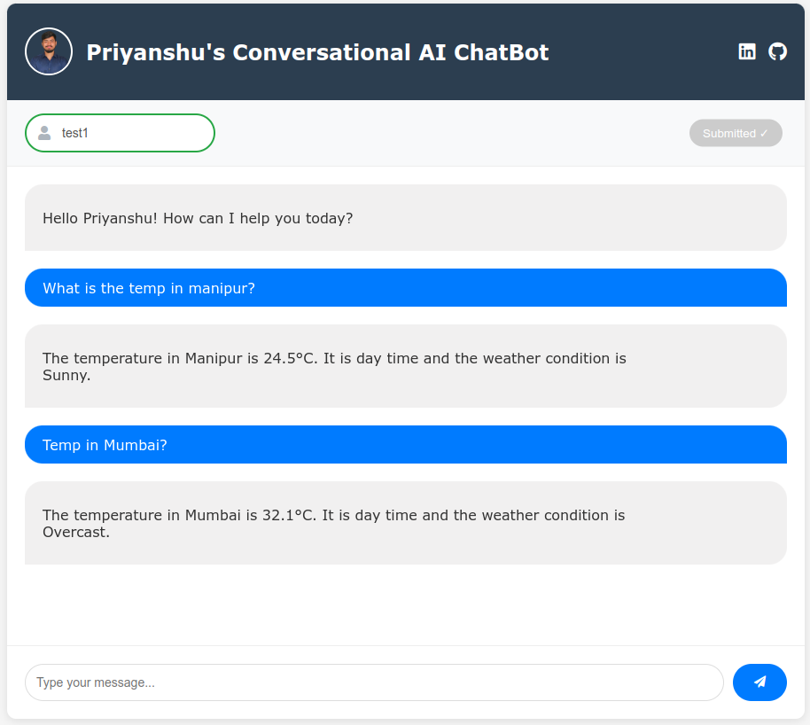

# Conversation Examples

### Usins: user_id = test1

### Blank conversation
1. Blank chat (No user ID)

### Basic conversation
1. Basic chat (Enter user ID to start chatting)

### Personalized Greetings
1. Personalized greetings (User ID specific)

### Context Memory
1. How to make panipuri

### Personal information (Persistent)
1. Personal information (Previously saved)

2. Personal information (Previously saved + new information)

### Weather queries
1. Weather queries (Location specific)

### Time queries
1. Time queries (Current time from system)

### Error handling
1. Error handling (Chat level)
